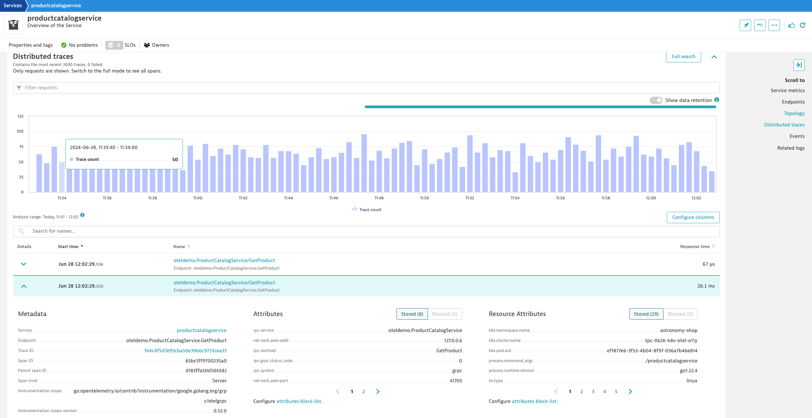
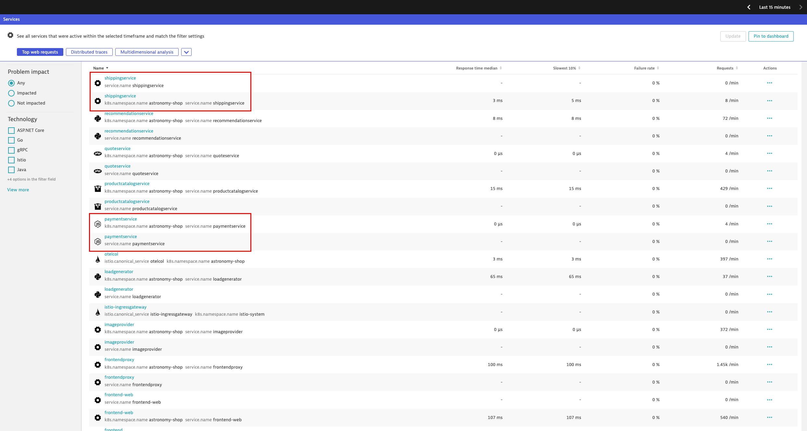
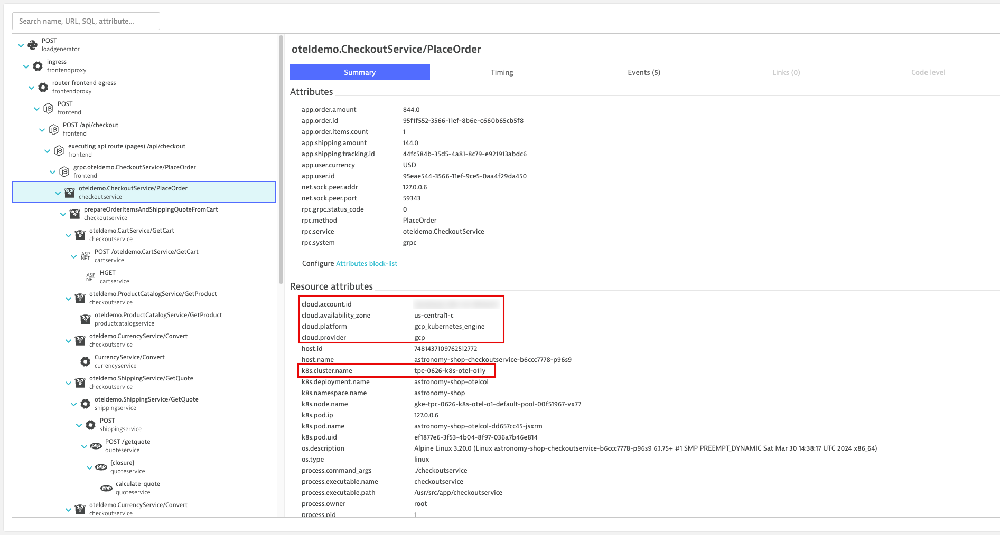

id: dt-k8s-otel-o11y-traces
summary: dynatrace otel trace ingest for kubernetes using opentelemetry collector
author: Tony Pope-Cruz

# Kubernetes OpenTelemetry Trace Ingest with Dynatrace
<!-- ------------------------ -->
## Overview 
Total Duration: 20

### What You’ll Learn Today
In this lab we'll utilize the OpenTelemetry Collector deployed as a Deployment (Gateway) to collect application traces/spans, generated by OpenTelemetry, from a Kubernetes cluster and ship them to Dynatrace.

Lab tasks:
1. Create a Kubernetes cluster on Google GKE
2. Deploy OpenTelemetry's demo application, astronomy-shop
3. Deploy OpenTelemetry Collector as a Deployment
4. Configure OpenTelemetry Collector service pipeline for span enrichment
5. Analyze application reliability via traces in Dynatrace




<!-- -------------------------->
## Technical Specification 
Duration: 2

#### Technologies Used
- [Dynatrace](https://www.dynatrace.com/trial)
- [Google Kubernetes Engine](https://cloud.google.com/kubernetes-engine)
  - tested on GKE v1.29.4-gke.1043002
- [OpenTelemetry Demo astronomy-shop](https://opentelemetry.io/docs/demo/)
  - tested on release 1.10.0
- [Istio](https://istio.io/latest/docs/)
  - tested on v1.22.1
- [OpenTelemetry Collector - Dynatrace Distro](https://docs.dynatrace.com/docs/extend-dynatrace/opentelemetry/collector/deployment)
  - tested on v0.8.0

#### Reference Architecture
TODO

#### Prerequisites
- Google Cloud Account
- Google Cloud Project
- Google Cloud Access to Create and Manage GKE Clusters
- Google CloudShell Access

<!-- -------------------------->
## Setup
Duration: 18

### Prerequisites

#### Deploy GKE cluster & demo assets
https://github.com/popecruzdt/dt-k8s-otel-o11y-cluster

#### Clone the repo to your home directory
Command:
```sh
git clone https://github.com/popecruzdt/dt-k8s-otel-o11y-traces.git
```
Sample output:
> Cloning into 'dt-k8s-otel-o11y-traces'...\
> ...\
> Receiving objects: 100% (12/12), 10.61 KiB | 1.77 MiB/s, done.

#### Move into repo base directory
Command:
```sh
cd dt-k8s-otel-o11y-traces
```

#### Generate Dynatrace Access Token
Generate a new API access token with the following scopes:
```
Ingest events
Ingest logs
Ingest metrics
Ingest OpenTelemetry traces
```
[See Related Dynatrace API Token Creation Documentation](https://docs.dynatrace.com/docs/dynatrace-api/basics/dynatrace-api-authentication#create-token)


#### (optional) Import Dashboard into Dynatrace
[dashboard](/k8s-otel-o11y-traces_dt_dashboard.json)

#### Define workshop user variables
In your GCP CloudShell Terminal:
```
DT_ENDPOINT=https://{your-environment-id}.live.dynatrace.com/api/v2/otlp
DT_API_TOKEN={your-api-token}
NAME=<INITIALS>-k8s-otel-o11y
```
### OpenTelemetry Collector - Dynatrace Distro
https://docs.dynatrace.com/docs/extend-dynatrace/opentelemetry/collector/deployment

#### Create `dynatrace` namespace
Command:
```sh
kubectl create namespace dynatrace
```
Sample output:
> namespace/dynatrace created

#### Create `dynatrace-otelcol-dt-api-credentials` secret
Command:
```sh
kubectl create secret generic dynatrace-otelcol-dt-api-credentials --from-literal=DT_ENDPOINT=$DT_ENDPOINT --from-literal=DT_API_TOKEN=$DT_API_TOKEN -n dynatrace
```
Sample output:
> secret/dynatrace-otelcol-dt-api-credentials created

#### Deploy `cert-manager`, pre-requisite for `opentelemetry-operator`
https://cert-manager.io/docs/installation/

Command:
```sh
kubectl apply -f https://github.com/cert-manager/cert-manager/releases/download/v1.14.4/cert-manager.yaml
```
Sample output:
> namespace/cert-manager created\
> customresourcedefinition.apiextensions.k8s.io/certificaterequests.cert-manager.io created\
> customresourcedefinition.apiextensions.k8s.io/certificates.cert-manager.io created\
> ...\
> validatingwebhookconfiguration.admissionregistration.k8s.io/cert-manager-webhook created

#### Deploy `opentelemetry-operator`
Command:
```sh
kubectl apply -f https://github.com/open-telemetry/opentelemetry-operator/releases/latest/download/opentelemetry-operator.yaml
```
Sample output:
> namespace/opentelemetry-operator-system created\
> customresourcedefinition.apiextensions.k8s.io/instrumentations.opentelemetry.io created\
> customresourcedefinition.apiextensions.k8s.io/opampbridges.opentelemetry.io created\
> ...\
> validatingwebhookconfiguration.admissionregistration.k8s.io/opentelemetry-operator-validating-webhook-configuration configured

#### Deploy OpenTelemetry Collector - Dynatrace Distro - Deployment (Gateway)
https://docs.dynatrace.com/docs/extend-dynatrace/opentelemetry/collector/deployment#tabgroup--dynatrace-docs--gateway
```yaml
---
apiVersion: opentelemetry.io/v1alpha1
kind: OpenTelemetryCollector
metadata:
  name: dynatrace-traces
  namespace: dynatrace
spec:
  envFrom:
  - secretRef:
      name: dynatrace-otelcol-dt-api-credentials
  mode: "deployment"
  image: "ghcr.io/dynatrace/dynatrace-otel-collector/dynatrace-otel-collector:latest"
```
Command:
```sh
kubectl apply -f opentelemetry/collector/traces/otel-collector-traces-crd-01.yaml
```
Sample output:
> opentelemetrycollector.opentelemetry.io/dynatrace-traces created

##### Validate running pod(s)
Command:
```sh
kubectl get pods -n dynatrace
```
Sample output:
| NAME                                       | READY | STATUS  | RESTARTS | AGE |
|--------------------------------------------|-------|---------|----------|-----|
| dynatrace-traces-collector-559d5b9d77-ms24p | 1/1   | Running | 0        | 1m  |

### Export OpenTelemetry data from `astronomy-shop` to OpenTelemetry Collector - Dynatrace Distro

#### Customize astronomy-shop helm values
```yaml
default:
  # List of environment variables applied to all components
  env:
    - name: OTEL_SERVICE_NAME
      valueFrom:
        fieldRef:
          apiVersion: v1
          fieldPath: "metadata.labels['app.kubernetes.io/component']"
    - name: OTEL_COLLECTOR_NAME
      value: '{{ include "otel-demo.name" . }}-otelcol'
    - name: OTEL_EXPORTER_OTLP_METRICS_TEMPORALITY_PREFERENCE
      value: cumulative
    - name: OTEL_RESOURCE_ATTRIBUTES
      value: 'service.name=$(OTEL_SERVICE_NAME),service.namespace=NAME_TO_REPLACE,service.version={{ .Chart.AppVersion }}'
```
> service.namespace=NAME_TO_REPLACE\
> service.namespace=INITIALS-k8s-otel-o11y

Command:
```sh
sed -i "s,NAME_TO_REPLACE,$NAME," astronomy-shop/collector-values.yaml
```

### Update `astronomy-shop` OpenTelemetry Collector export endpoint via helm
Command:
```sh
helm upgrade astronomy-shop open-telemetry/opentelemetry-demo --values astronomy-shop/collector-values.yaml --namespace astronomy-shop
```
Sample output:
> NAME: astronomy-shop\
> LAST DEPLOYED: Thu Jun 27 20:58:38 2024\
> NAMESPACE: astronomy-shop\
> STATUS: deployed\
> REVISION: 2

##### `otlp` receiver
https://github.com/open-telemetry/opentelemetry-collector/tree/main/receiver/otlpreceiver
```yaml
config: |
    receivers:
      otlp:
        protocols:
          grpc:
            endpoint: 0.0.0.0:4317
          http:
            endpoint: 0.0.0.0:4318
    service:
      pipelines:
        traces:
          receivers: [otlp]
          processors: [batch]
          exporters: [otlphttp/dynatrace]
```

##### OpenTelemetry Traces in Dynatrace
Result:\


[Refer to the Dynatrace documentation for more details](https://docs.dynatrace.com/docs/observe-and-explore/distributed-traces/analysis/get-started)

### Configure OpenTelemetry Collector Service Pipeline

##### Create `clusterrole` with read access to Kubernetes objects
```yaml
---
apiVersion: rbac.authorization.k8s.io/v1
kind: ClusterRole
metadata:
  name: otel-collector-k8s-clusterrole-traces
rules:
- apiGroups: [""]
  resources: ["pods", "namespaces", "nodes"]
  verbs: ["get", "watch", "list"]
- apiGroups: ["apps"]
  resources: ["replicasets"]
  verbs: ["get", "list", "watch"]
- apiGroups: ["extensions"]
  resources: ["replicasets"]
  verbs: ["get", "list", "watch"]
```
Command:
```sh
kubectl apply -f opentelemetry/rbac/otel-collector-k8s-clusterrole-traces.yaml
```
Sample output:
> clusterrole.rbac.authorization.k8s.io/otel-collector-k8s-clusterrole-traces created

##### Create `clusterrolebinding` for OpenTelemetry Collector service account
```yaml
---
apiVersion: rbac.authorization.k8s.io/v1
kind: ClusterRoleBinding
metadata:
  name: otel-collector-k8s-clusterrole-traces-crb
subjects:
- kind: ServiceAccount
  name: dynatrace-traces-collector
  namespace: dynatrace
roleRef:
  kind: ClusterRole
  name: otel-collector-k8s-clusterrole-traces
  apiGroup: rbac.authorization.k8s.io
```
Command:
```sh
kubectl apply -f opentelemetry/rbac/otel-collector-k8s-clusterrole-traces-crb.yaml
```
Sample output:
> clusterrolebinding.rbac.authorization.k8s.io/otel-collector-k8s-clusterrole-traces-crb created

##### Add `k8sattributes` processor
https://opentelemetry.io/docs/kubernetes/collector/components/#kubernetes-attributes-processor
```yaml
k8sattributes:
    auth_type: "serviceAccount"
    passthrough: false
        filter:
        node_from_env_var: KUBE_NODE_NAME
    extract:
        metadata:
            - k8s.namespace.name
            - k8s.deployment.name
            - k8s.daemonset.name
            - k8s.job.name
            - k8s.cronjob.name
            - k8s.replicaset.name
            - k8s.statefulset.name
            - k8s.pod.name
            - k8s.pod.uid
            - k8s.node.name
            - k8s.container.name
            - container.id
            - container.image.name
            - container.image.tag
        labels:
        - tag_name: app.label.component
            key: app.kubernetes.io/component
            from: pod
    pod_association:
        - sources:
            - from: resource_attribute
              name: k8s.pod.uid
        - sources:
            - from: resource_attribute
              name: k8s.pod.name
        - sources:
            - from: resource_attribute
              name: k8s.pod.ip
        - sources:
            - from: connection
```
Command:
```sh
kubectl apply -f opentelemetry/collector/traces/otel-collector-traces-crd-02.yaml
```
Sample output:
> opentelemetrycollector.opentelemetry.io/dynatrace-traces configured

##### Validate running pod(s)
Command:
```sh
kubectl get pods -n dynatrace
```
Sample output:
| NAME                                       | READY | STATUS  | RESTARTS | AGE |
|--------------------------------------------|-------|---------|----------|-----|
| dynatrace-traces-collector-559d5b9d77-xn84p | 1/1   | Running | 0        | 1m  |


##### OpenTelemetry Traces in Dynatrace with Kubernetes Attributes
Dynatrace utilizes the `service.name`, `k8s.workload.name` and `k8s.namespace.name` to generate the unified service.\
https://docs.dynatrace.com/docs/platform-modules/applications-and-microservices/services/service-detection-and-naming/service-types/unified-service#service-detection

Result:\



##### Add `resourcedetection` processor (gcp)
https://github.com/open-telemetry/opentelemetry-collector-contrib/blob/main/processor/resourcedetectionprocessor/README.md#gcp-metadata
```yaml
processors:
  resourcedetection/gcp:
    detectors: [env, gcp]
    timeout: 2s
    override: false
```
Command:
```sh
kubectl apply -f opentelemetry/collector/traces/otel-collector-traces-crd-03.yaml
```
Sample output:
> opentelemetrycollector.opentelemetry.io/dynatrace-traces configured

##### Validate running pod(s)
Command:
```sh
kubectl get pods -n dynatrace
```
Sample output:
| NAME                                       | READY | STATUS  | RESTARTS | AGE |
|--------------------------------------------|-------|---------|----------|-----|
| dynatrace-traces-collector-559d5b9d77-rp21d | 1/1   | Running | 0        | 1m  |


##### OpenTelemetry Traces in Dynatrace with GCP/GKE Attributes
Result:\


##### Add `resource` processor (attributes)
https://github.com/open-telemetry/opentelemetry-collector-contrib/tree/main/processor/resourceprocessor
```yaml
processors:
    resource:
        attributes:
        - key: k8s.pod.ip
          action: delete
        - key: telemetry.sdk.name
          value: opentelemetry
          action: insert
        - key: dynatrace.otel.collector
          value: dynatrace-traces
          action: insert
        - key: dt.security_context
          from_attribute: k8s.cluster.name
          action: insert
```
Command:
```sh
kubectl apply -f opentelemetry/collector/traces/otel-collector-traces-crd-04.yaml
```
Sample output:
> opentelemetrycollector.opentelemetry.io/dynatrace-traces configured

##### Validate running pod(s)
Command:
```sh
kubectl get pods -n dynatrace
```
Sample output:
| NAME                                       | READY | STATUS  | RESTARTS | AGE |
|--------------------------------------------|-------|---------|----------|-----|
| dynatrace-traces-collector-559d5b9d77-ny98q | 1/1   | Running | 0        | 1m  |


##### OpenTelemetry Traces in Dynatrace with Custom Resource Attributes
Result:\


### Dynatrace Dashboard with Unified Services from OpenTelemetry


<!-- ------------------------ -->
## Demo The New Functionality
TODO

<!-- -------------------------->
## Wrap Up

### What You Learned Today 
By completing this lab, you've successfully deployed the OpenTelemetry Collector to collect traces, enrich span attributes for better context, and ship those traces/spans to Dynatrace for analysis.
- The OpenTelemetry Collector was deployed as a Deployment, behaving as a Gateway on the cluster
- The Dynatrace Distro of OpenTelemetry Collector includes supported modules needed to ship traces to Dynatrace
  - The `otlp` receiver receives traces (and other signals) from OpenTelemetry exporters via gRPC/HTTP
  - The `k8sattributes` processor enriches the spans with Kubernetes attributes
  - The `resourcedetection` processor enriches the spans with cloud and cluster (GCP/GKE) attributes
  - The `resource` processor enriches the spans with custom (resource) attributes
- Dynatrace allows you to perform powerful queries and analysis of the trace/span data

<!-- ------------------------ -->
### Supplemental Material
TODO
