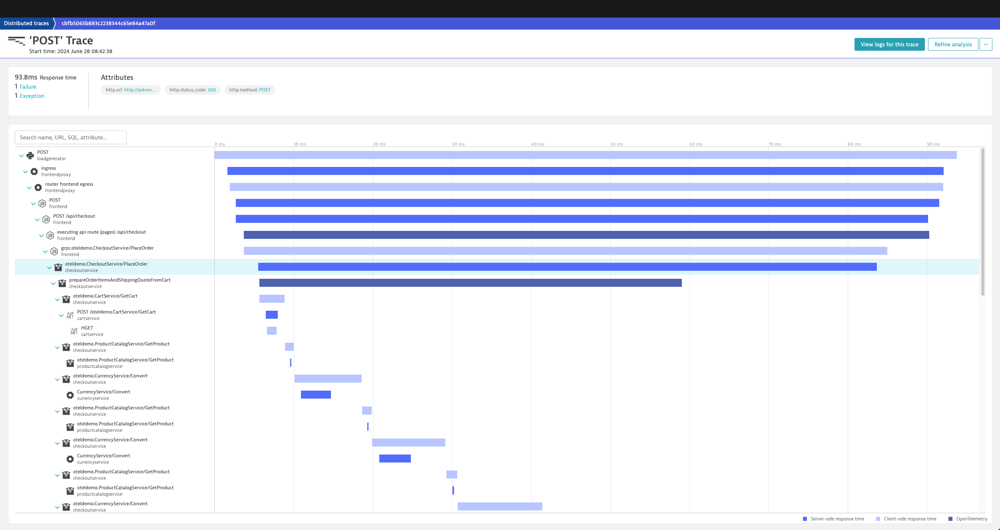

## Deploy OpenTelemetry Collector Deployment
https://docs.dynatrace.com/docs/extend-dynatrace/opentelemetry/collector/deployment#tabgroup--dynatrace-docs--gateway
```yaml
---
apiVersion: opentelemetry.io/v1alpha1
kind: OpenTelemetryCollector
metadata:
  name: dynatrace-traces
  namespace: dynatrace
spec:
  envFrom:
  - secretRef:
      name: dynatrace-otelcol-dt-api-credentials
  mode: "deployment"
  image: "ghcr.io/dynatrace/dynatrace-otel-collector/dynatrace-otel-collector:latest"
```
Command:
```sh
kubectl apply -f opentelemetry/collector/traces/otel-collector-traces-crd-01.yaml
```
Sample output:
> opentelemetrycollector.opentelemetry.io/dynatrace-traces created

### Validate running pod(s)
Command:
```sh
kubectl get pods -n dynatrace
```
Sample output:
| NAME                                       | READY | STATUS  | RESTARTS | AGE |
|--------------------------------------------|-------|---------|----------|-----|
| dynatrace-traces-collector-559d5b9d77-ms24p | 1/1   | Running | 0        | 1m  |

### Export OpenTelemetry data from `astronomy-shop` to OpenTelemetry Collector - Dynatrace Distro

### Customize astronomy-shop helm values
```yaml
default:
  # List of environment variables applied to all components
  env:
    - name: OTEL_SERVICE_NAME
      valueFrom:
        fieldRef:
          apiVersion: v1
          fieldPath: "metadata.labels['app.kubernetes.io/component']"
    - name: OTEL_COLLECTOR_NAME
      value: '{{ include "otel-demo.name" . }}-otelcol'
    - name: OTEL_EXPORTER_OTLP_METRICS_TEMPORALITY_PREFERENCE
      value: cumulative
    - name: OTEL_RESOURCE_ATTRIBUTES
      value: 'service.name=$(OTEL_SERVICE_NAME),service.namespace=NAME_TO_REPLACE,service.version={{ .Chart.AppVersion }}'
```
> service.namespace=NAME_TO_REPLACE\
> service.namespace=INITIALS-k8s-otel-o11y

Command:
```sh
sed -i "s,NAME_TO_REPLACE,$NAME," astronomy-shop/collector-values.yaml
```

### Update `astronomy-shop` OpenTelemetry Collector export endpoint via helm
Command:
```sh
helm upgrade astronomy-shop open-telemetry/opentelemetry-demo --values astronomy-shop/collector-values.yaml --namespace astronomy-shop --version "0.31.0"
```
Sample output:
> NAME: astronomy-shop\
> LAST DEPLOYED: Thu Jun 27 20:58:38 2024\
> NAMESPACE: astronomy-shop\
> STATUS: deployed\
> REVISION: 2

### `otlp` receiver
https://github.com/open-telemetry/opentelemetry-collector/tree/main/receiver/otlpreceiver
```yaml
config: |
    receivers:
      otlp:
        protocols:
          grpc:
            endpoint: 0.0.0.0:4317
          http:
            endpoint: 0.0.0.0:4318
    service:
      pipelines:
        traces:
          receivers: [otlp]
          processors: [batch]
          exporters: [otlphttp/dynatrace]
```

### OpenTelemetry Traces in Dynatrace
Result:




[Refer to the Dynatrace documentation for more details](https://docs.dynatrace.com/docs/observe-and-explore/distributed-traces/analysis/get-started)