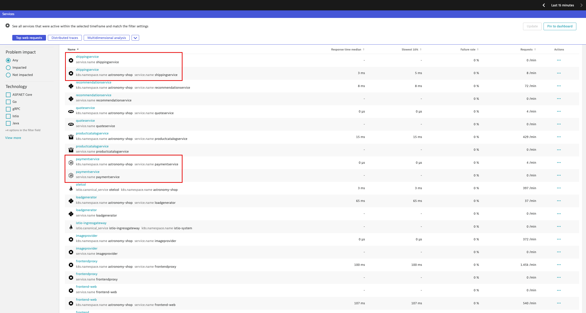

## k8sattributes Processor

### Create `clusterrole` with read access to Kubernetes objects
```yaml
---
apiVersion: rbac.authorization.k8s.io/v1
kind: ClusterRole
metadata:
  name: otel-collector-k8s-clusterrole-traces
rules:
- apiGroups: [""]
  resources: ["pods", "namespaces", "nodes"]
  verbs: ["get", "watch", "list"]
- apiGroups: ["apps"]
  resources: ["replicasets"]
  verbs: ["get", "list", "watch"]
- apiGroups: ["extensions"]
  resources: ["replicasets"]
  verbs: ["get", "list", "watch"]
```
Command:
```sh
kubectl apply -f opentelemetry/rbac/otel-collector-k8s-clusterrole-traces.yaml
```
Sample output:
> clusterrole.rbac.authorization.k8s.io/otel-collector-k8s-clusterrole-traces created

### Create `clusterrolebinding` for OpenTelemetry Collector service account
```yaml
---
apiVersion: rbac.authorization.k8s.io/v1
kind: ClusterRoleBinding
metadata:
  name: otel-collector-k8s-clusterrole-traces-crb
subjects:
- kind: ServiceAccount
  name: dynatrace-traces-collector
  namespace: dynatrace
roleRef:
  kind: ClusterRole
  name: otel-collector-k8s-clusterrole-traces
  apiGroup: rbac.authorization.k8s.io
```
Command:
```sh
kubectl apply -f opentelemetry/rbac/otel-collector-k8s-clusterrole-traces-crb.yaml
```
Sample output:
> clusterrolebinding.rbac.authorization.k8s.io/otel-collector-k8s-clusterrole-traces-crb created

### Add `k8sattributes` processor
https://opentelemetry.io/docs/kubernetes/collector/components/#kubernetes-attributes-processor

The `k8sattributes` processor will query metadata from the cluster about the k8s objects.  The Collector will then marry this metadata to the telemetry.

```yaml
k8sattributes:
    auth_type: "serviceAccount"
    passthrough: false
        filter:
        node_from_env_var: KUBE_NODE_NAME
    extract:
        metadata:
            - k8s.namespace.name
            - k8s.deployment.name
            - k8s.daemonset.name
            - k8s.job.name
            - k8s.cronjob.name
            - k8s.replicaset.name
            - k8s.statefulset.name
            - k8s.pod.name
            - k8s.pod.uid
            - k8s.node.name
            - k8s.container.name
            - container.id
            - container.image.name
            - container.image.tag
        labels:
        - tag_name: app.label.component
            key: app.kubernetes.io/component
            from: pod
    pod_association:
        - sources:
            - from: resource_attribute
              name: k8s.pod.uid
        - sources:
            - from: resource_attribute
              name: k8s.pod.name
        - sources:
            - from: resource_attribute
              name: k8s.pod.ip
        - sources:
            - from: connection
```
Command:
```sh
kubectl apply -f opentelemetry/collector/traces/otel-collector-traces-crd-02.yaml
```
Sample output:
> opentelemetrycollector.opentelemetry.io/dynatrace-traces configured

### Validate running pod(s)
Command:
```sh
kubectl get pods -n dynatrace
```
Sample output:
| NAME                                       | READY | STATUS  | RESTARTS | AGE |
|--------------------------------------------|-------|---------|----------|-----|
| dynatrace-traces-collector-559d5b9d77-xn84p | 1/1   | Running | 0        | 1m  |


### OpenTelemetry Traces in Dynatrace with Kubernetes Attributes
Dynatrace utilizes the `service.name`, `k8s.workload.name` and `k8s.namespace.name` to generate the unified service.

https://docs.dynatrace.com/docs/platform-modules/applications-and-microservices/services/service-detection-and-naming/service-types/unified-service#service-detection

Result:


