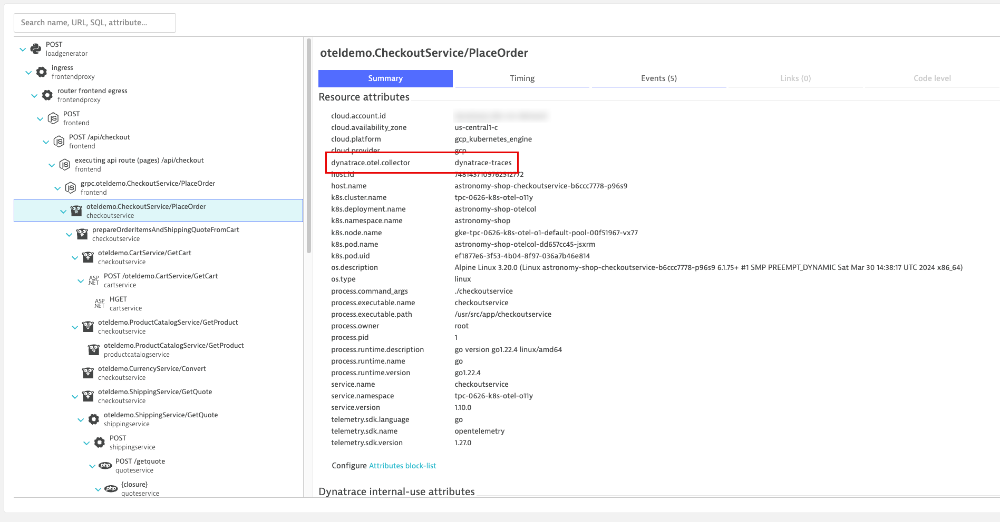
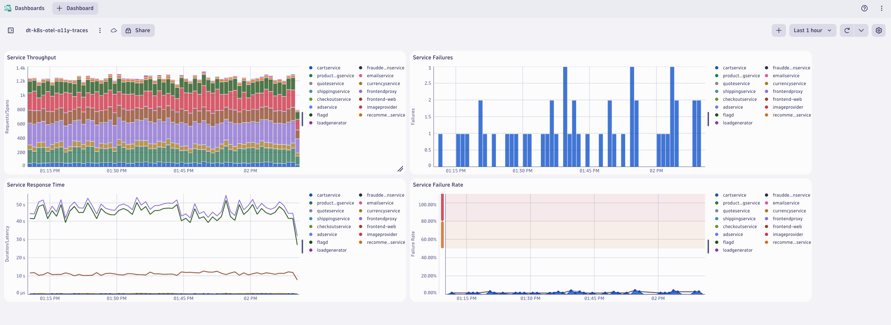

## resource Processor

### Add `resource` processor (attributes)
https://github.com/open-telemetry/opentelemetry-collector-contrib/tree/main/processor/resourceprocessor
```yaml
processors:
    resource:
        attributes:
        - key: k8s.pod.ip
          action: delete
        - key: telemetry.sdk.name
          value: opentelemetry
          action: insert
        - key: dynatrace.otel.collector
          value: dynatrace-traces
          action: insert
        - key: dt.security_context
          from_attribute: k8s.cluster.name
          action: insert
```
Command:
```sh
kubectl apply -f opentelemetry/collector/traces/otel-collector-traces-crd-04.yaml
```
Sample output:
> opentelemetrycollector.opentelemetry.io/dynatrace-traces configured

### Validate running pod(s)
Command:
```sh
kubectl get pods -n dynatrace
```
Sample output:
| NAME                                       | READY | STATUS  | RESTARTS | AGE |
|--------------------------------------------|-------|---------|----------|-----|
| dynatrace-traces-collector-559d5b9d77-ny98q | 1/1   | Running | 0        | 1m  |


### OpenTelemetry Traces in Dynatrace with Custom Resource Attributes
Result:



### Dynatrace Dashboard with Unified Services from OpenTelemetry


